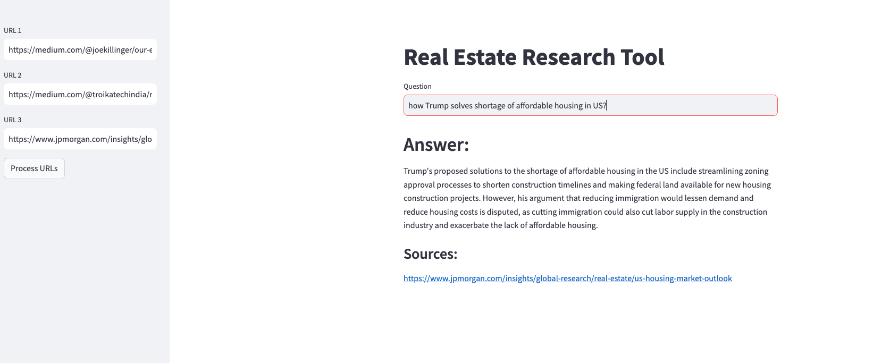

# 🏙️ **RealEstate Research Tool**

The RealEstate Research Tool is a powerful, user-friendly platform designed to help users quickly retrieve relevant information from real estate news articles. By simply inputting article URLs, users can ask questions and get insightful answers based on the content. While the tool is optimized for the real estate domain, its capabilities can easily be extended to other industries or areas of interest.

With seamless integration of advanced natural language processing (NLP) technologies and a robust search system, this tool empowers users to extract meaningful insights from news articles with ease.


### Features

- Load URLs to fetch article content.
- Process article content through LangChain's UnstructuredURL Loader
- Construct an embedding vector using HuggingFace embeddings and leverage ChromaDB as the vectorstore, to enable swift and effective retrieval of relevant information.
- Interact with the LLM's (Llama3 via Groq) by inputting queries and receiving answers along with source URLs.


### Set-up

1. Run the following command to install all dependencies. 

    ```bash
    pip install -r requirements.txt
    ```

2. Create a .env file with your GROQ credentials as follows:
    ```text
    GROQ_API_KEY=GROQ_API_KEY_HERE
    ```

3. Run the streamlit app by running the following command.

    ```bash
    streamlit run main.py
    ```


### Usage/Examples

The web app will open in your browser after the set-up is complete.

- On the sidebar, you can input URLs directly.

- Initiate the data loading and processing by clicking "Process URLs."

- Observe the system as it performs text splitting, generates embedding vectors using HuggingFace's Embedding Model.

- The embeddings will be stored in ChromaDB.

- One can now ask a question and get the answer based on those news articles

- In the app, we will use the following news articles
  - https://medium.com/@joekillinger/our-experience-as-real-estate-brokers-for-elon-musks-futuristic-project-c1175ff28fc1
  - https://medium.com/@troikatechindia/real-estate-marketing-mistakes-fc3301a88f14
  - https://www.jpmorgan.com/insights/global-research/real-estate/us-housing-market-outlook

</br>


### App Screenshot


